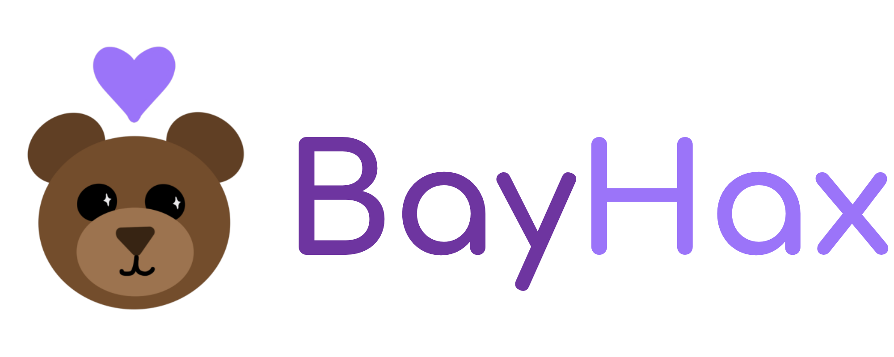

# BayHax

A Stuffed Animal Toy To Track Mood Changes

BayHax is a handy tool for parents to look after their child's emotional health. This mood tracker is perfect for young children and/or children with disabilities who have difficulty communicating their emotions.
